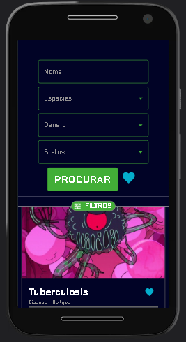
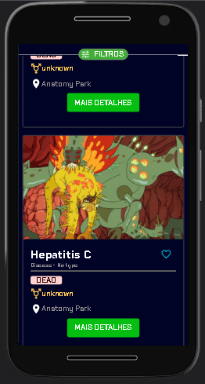
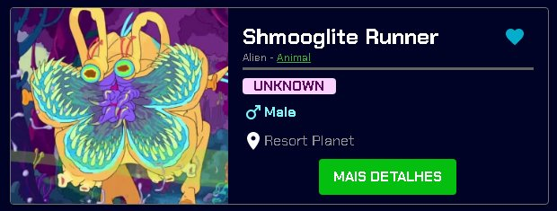
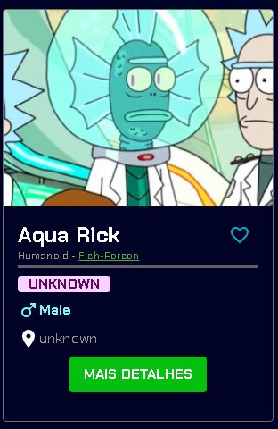
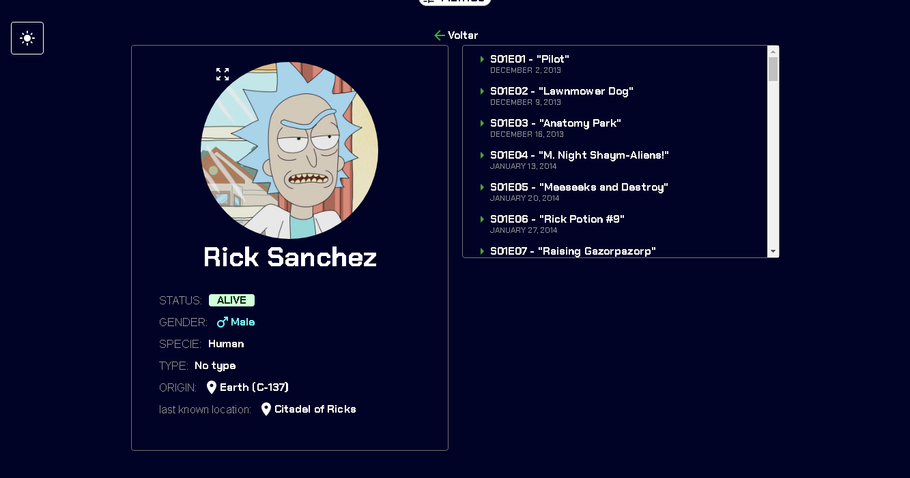
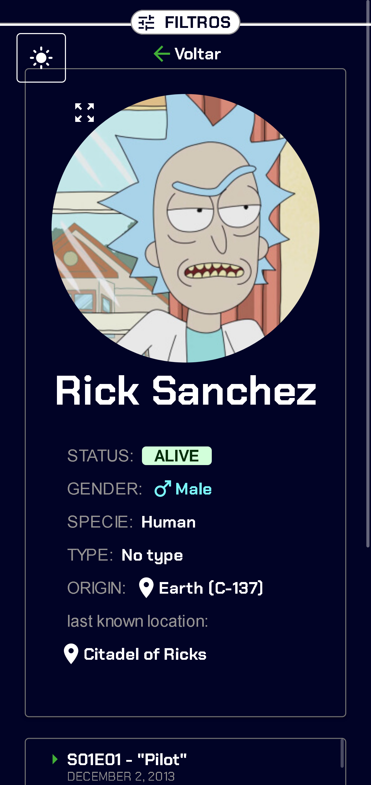
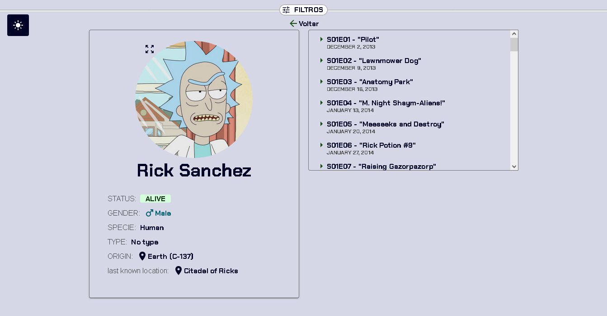

## 1. Projeto 

O site de busca de personagens de **Rick and Morty**.  você pode encontrar informações detalhadas sobre qualquer personagem que já tenha aparecido no programa

######  execução do projeto:
1. DESIGN
    - FILTRO: Tomei como    referencia a escolha de filtros do **youtube**. Onde não ocuparia a maior parte da tela em **celulares**,
    e o  usuario sempre poderia mudar o filtro sem precisar ir até o topo da pagina toda vez. 
    

        
        
    

    
    - CARD: tomei como referencia da propria api na pagina inicial, as cores foram tiradas da serie, e cores onde possa informar ao usuario mais rapido uma informação
    
    

        
        
    

    - CARD COM MAIS INFO
    

        
        
    

    - TEMA LIGHT
     

1. FRONT-END
    - MATERIAL UI: Preferi o usar por já possuir componentes prontos para a aplicação como: drawer, paginação e card. Além de outros componentes, icones
    
    - VITE: O Vite por oferece uma experiência de desenvolvimento mais rápida e leve
    
    - REACT ROUTER DOM: Usei de forma que podesse buscar um personagem especifico atraves da url em vez de modais, e passando na propria url informações de consulta sendo filtro ou favoritos

### 2. Tecnologias

- [React](https://react.dev/)
- [Vite](https://vitejs.dev/guide/)
- [Material UI](https://mui.com/material-ui/getting-started/overview/)
- [Typescript](https://www.typescriptlang.org/docs/)
- [Axios](https://axios-http.com/ptbr/docs/intro)
- [React router dom](https://reactrouter.com/en/main)
- [Eslint](https://eslint.org/docs/latest/use/getting-started)

Guia de estilos: [Airbnb](https://github.com/airbnb/javascript) 
Commits semânticos: [AngularJS](https://karma-runner.github.io/3.0/dev/git-commit-msg.html)
### 3. Como rodar

Para utilizar você precisará instalar:
 1. [Node](https://nodejs.org/en), prefira pela versão **LTS** 
    caso precise de ajuda [como baixar](https://youtu.be/8FefZGAGvGM) 

1. Apos a instalação baixe o **Yarn** rode:  `npm i -G yarn`
2. Após baixar o Yarn rode:`yarn` para baixar as dependencias
3. Para iniciar o projeto  rode `yarn dev`
        

### 4. Link para acessar o projeto web.
projeto [Rick And Morty](https://julio-2001.github.io/react-test)